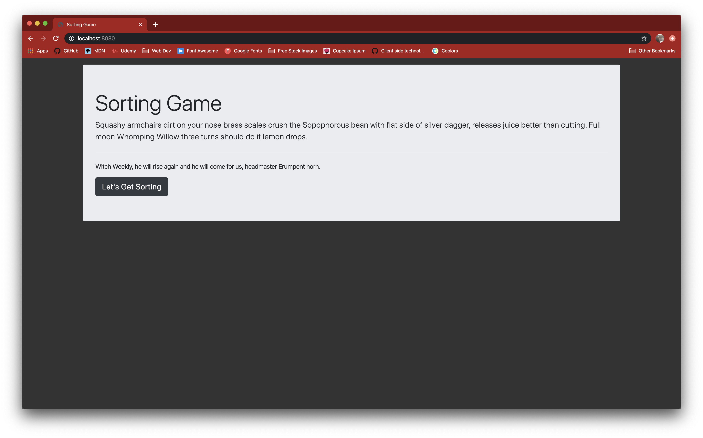
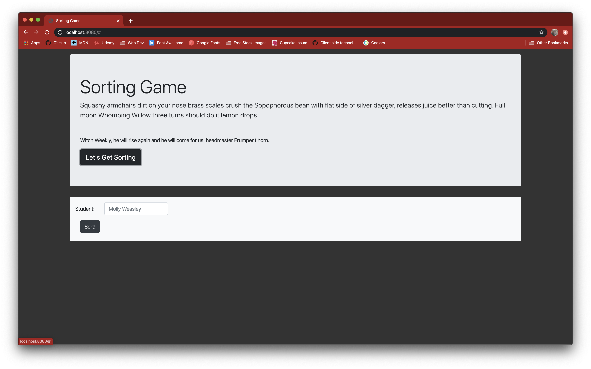
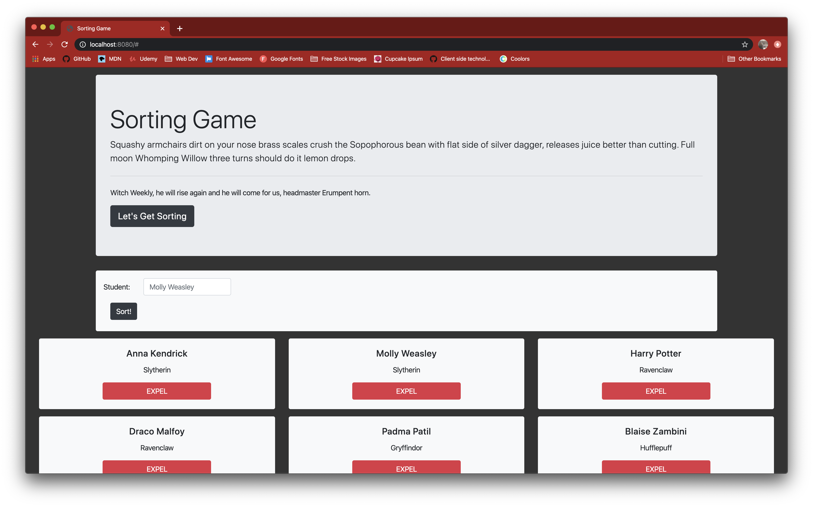

# sorting-game

## Description
This project is an introductory exploration of the use of vanilla javascript event listeners and their accompanying functions. The sorting game is styled using bootstrap, with a jumbotron, a form, and cards. Input a name in the form to be randomly sorted into a Hogwarts House, and expel one student at a time by pressing the expel button on a card.

## Screenshots

After Pressing Get Sorting:

After adding Name in Form:

## Instructions / How to Run
1. Clone down this repo
2. Make sure you have http-server installed via npm. If not get it here [HERE](https://www.npmjs.com/package/http-server)
3. On your command line run `hs -p 9999`
4. In your browser go to `http://localhost:9999`